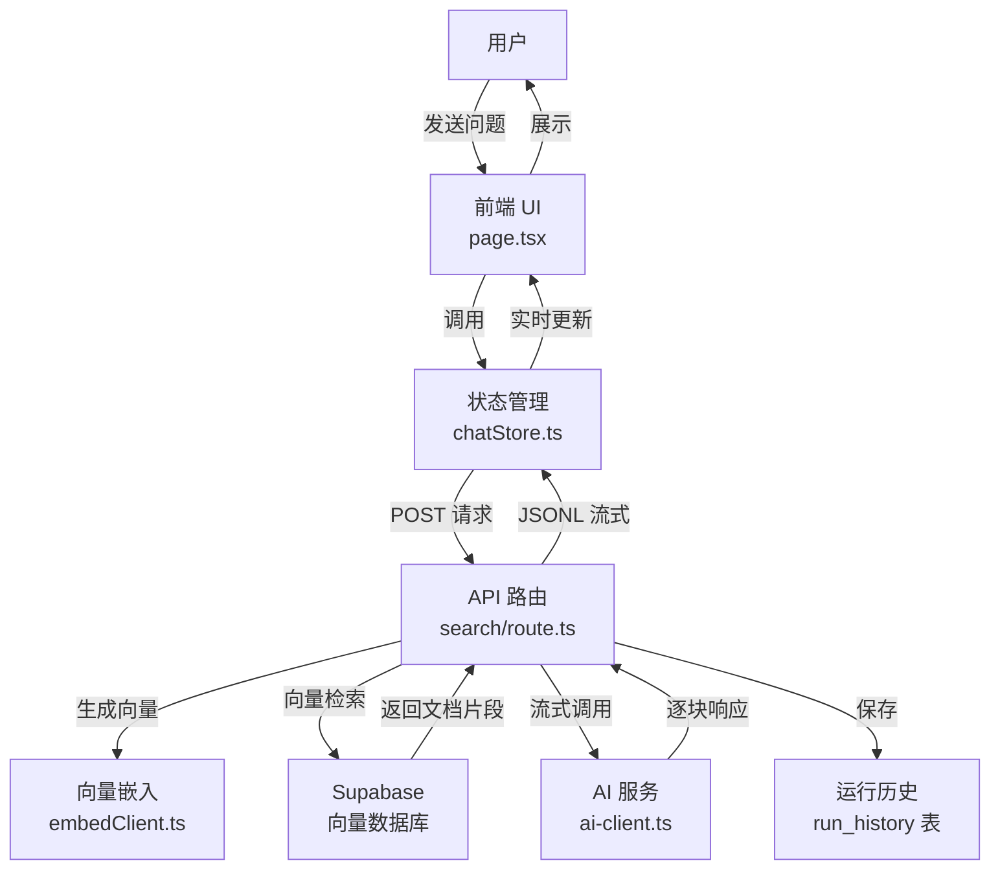
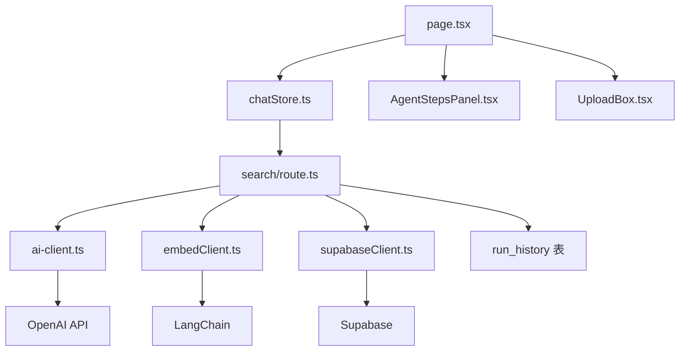

# 企业文档智能助手项目分析

## 1. 项目概述

这是一个基于 Next.js 15.5.7 的企业文档智能助手项目，采用 RAG (检索增强生成) 技术，为企业提供智能文档问答、文档管理和运行历史追踪功能。项目具有完整的流式响应系统，能够实时展示 AI 思考过程，提供良好的用户体验。

### 核心功能
- 智能文档问答系统
- 文档管理与上传
- 运行历史追踪
- 流式响应与实时可视化
- RAG 参数可配置

## 2. 技术栈

| 类别 | 技术 | 版本 | 用途 |
|------|------|------|------|
| 框架 | Next.js | 15.5.7 | 应用框架，App Router 架构 |
| 语言 | TypeScript | 5.x | 类型安全的开发语言 |
| 前端状态 | Zustand | 5.0.8 | 轻量级状态管理 |
| UI 渲染 | React | 19.1.0 | 前端 UI 库 |
| 数据库 | Supabase | 2.77.0 | PostgreSQL + 向量扩展 |
| AI 服务 | OpenAI/SiliconFlow | 6.4.0 | 大语言模型调用 |
| 向量嵌入 | LangChain | 1.0.2 | 文本向量化 |
| Markdown | React Markdown | 10.1.0 | Markdown 渲染 |
| 样式 | Tailwind CSS | 4.x | 实用优先的 CSS 框架 |

## 3. 项目结构

```
/Users/able/code/next/
├── src/
│   ├── app/                 # Next.js App Router
│   │   ├── api/             # API 路由
│   │   │   ├── ask/         # 简单问答 API
│   │   │   ├── documents/   # 文档管理 API
│   │   │   ├── runs/        # 运行历史 API
│   │   │   ├── search/      # 核心搜索 API (带流式响应)
│   │   │   └── upload/      # 文件上传 API
│   │   ├── documents/       # 文档页面
│   │   ├── runs/            # 运行历史页面
│   │   ├── layout.tsx       # 根布局
│   │   └── page.tsx         # 首页
│   ├── components/          # React 组件
│   │   ├── AgentStepsPanel.tsx  # Agent 执行步骤面板
│   │   ├── MarkdownRenderer.tsx # Markdown 渲染器
│   │   └── UploadBox.tsx    # 文件上传组件
│   ├── lib/                 # 工具库
│   │   ├── ai-client.ts     # AI 客户端
│   │   ├── embedClient.ts   # 向量嵌入客户端
│   │   └── supabaseClient.ts # Supabase 客户端
│   ├── store/               # 状态管理
│   │   └── chatStore.ts     # 聊天状态管理
│   └── types/               # TypeScript 类型定义
│       ├── agent.ts         # Agent 相关类型
│       └── chat.ts          # 聊天相关类型
├── package.json             # 项目配置与依赖
├── next.config.ts           # Next.js 配置
└── tsconfig.json            # TypeScript 配置
```

## 4. 架构设计

### 4.1 整体架构



### 4.2 数据流

1. **用户输入** → 前端 UI 捕获用户问题
2. **状态初始化** → chatStore 创建消息记录，设置加载状态
3. **API 调用** → 发送 POST 请求到 /api/search，包含问题、历史和 RAG 参数
4. **后端处理** → 生成查询向量、检索文档、调用 AI 服务
5. **流式响应** → 后端发送 step、sources、delta 事件
6. **前端处理** → 实时解析和更新 UI 显示
7. **完成响应** → 后端关闭流，保存运行历史
8. **前端更新** → 最终状态更新，结束加载状态

## 5. 核心功能实现

### 5.1 流式响应系统

**后端实现** (`/api/search/route.ts`):
- 使用 `ReadableStream` 创建自定义可读流
- 实现 JSONL 格式的流式响应
- 支持多种事件类型：step、sources、delta、error
- 流式调用 AI 服务，逐块处理响应

**前端实现** (`chatStore.ts`):
- 使用 `fetch API` 获取流式响应
- 实现 `ReadableStreamDefaultReader` 读取流数据
- 解析 JSONL 格式，处理不同类型的事件
- 实时更新 Zustand 状态，触发 UI 重新渲染

**关键代码**：
```typescript
// 后端：创建流式响应
const stream = new ReadableStream({
  async start(controller) {
    const sendJSON = (obj: any) => {
      controller.enqueue(encoder.encode(JSON.stringify(obj) + "\n"));
    };
    
    // 流式调用 AI
    const completion = await aiClient.chat.completions.create({
      model: AI_MODEL,
      stream: true,
      messages: [...]
    });
    
    // 逐块处理
    for await (const chunk of completion) {
      const delta = chunk.choices?.[0]?.delta?.content;
      if (delta) {
        sendJSON({ type: "delta", data: delta });
      }
    }
  }
});

// 前端：处理流式响应
const reader = res.body.getReader();
while (!done) {
  const { value, done: doneReading } = await reader.read();
  buffer += decoder.decode(value, { stream: true });
  const lines = buffer.split("\n");
  buffer = lines.pop() || "";
  
  for (const line of lines) {
    if (!line.trim()) continue;
    const data = JSON.parse(line);
    
    if (data.type === "delta") {
      currentContent += data.data;
      set((prev) => ({
        messages: prev.messages.map((msg) =>
          msg.id === assistantId
            ? { ...msg, content: currentContent }
            : msg
        )
      }));
    }
  }
}
```

### 5.2 智能文档问答

**核心流程**：
1. 用户输入问题
2. 生成问题的向量表示
3. 在向量数据库中检索相关文档片段
4. 构建上下文，调用 AI 生成回答
5. 流式返回回答和相关来源

**RAG 优化**：
- 可配置的检索参数 (topK, threshold)
- 文档片段相似度排序
- 多轮对话历史支持

### 5.3 文档管理系统

**功能**：
- 文档上传与解析
- 文档片段化存储
- 文档详情查看
- 文档来源追踪

**API**：
- `GET /api/documents` - 获取文档列表
- `POST /api/documents` - 上传新文档
- `GET /api/documents/[id]` - 获取文档详情

### 5.4 运行历史追踪

**功能**：
- 自动记录每次问答的完整流程
- 保存 RAG 检索参数和结果
- 支持运行详情查看
- 提供调试回放能力

**数据结构**：
```typescript
// run_history 表结构
{
  id: number,
  question: string,
  answer: string,
  topk: number,
  threshold: number,
  matched_count: number,
  duration_ms: number,
  steps: StepLog[],
  sources: MatchRow[],
  created_at: timestamp
}
```

## 6. API 设计

### 6.1 核心 API

| API 路径 | 方法 | 功能 | 请求体 | 响应 |
|---------|------|------|--------|------|
| `/api/search` | POST | 核心问答 API，支持流式响应和运行历史 | `{ question, history, topK, threshold }` | JSONL 流式响应 |
| `/api/ask` | POST | 简单问答 API，不带运行历史 | `{ question }` | JSON 响应 |
| `/api/documents` | GET | 获取文档列表 | N/A | `{ documents: [] }` |
| `/api/documents` | POST | 上传新文档 | `FormData` | `{ id, name, status }` |
| `/api/documents/[id]` | GET | 获取文档详情 | N/A | `{ document, chunks }` |
| `/api/runs` | GET | 获取运行历史列表 | N/A | `{ runs: [] }` |
| `/api/runs/[id]` | GET | 获取运行详情 | N/A | `{ run }` |
| `/api/upload` | POST | 文件上传 API | `FormData` | `{ url, filename }` |

### 6.2 流式响应格式

项目使用 JSONL (JSON Lines) 格式实现流式响应，每行一个 JSON 对象：

| 事件类型 | 数据结构 | 描述 |
|---------|---------|------|
| `step` | `{ id, title, status, detail }` | Agent 执行步骤更新 |
| `sources` | `[{ id, document_id, content, similarity }]` | 文档来源信息 |
| `delta` | `{ data: string }` | AI 生成的文本片段 |
| `error` | `{ data: string }` | 错误信息 |

**示例响应**：
```json
{"type":"step","data":{"id":"received","title":"收到问题","status":"done","detail":"如何使用这个系统?"}}
{"type":"step","data":{"id":"embed","title":"生成查询向量","status":"running"}}
{"type":"step","data":{"id":"embed","title":"生成查询向量","status":"done"}}
{"type":"step","data":{"id":"retrieve","title":"检索相关文档片段","status":"running","detail":"topK=5, threshold=0.4"}}
{"type":"step","data":{"id":"retrieve","title":"检索相关文档片段","status":"done","detail":"命中 3 条片段"}}
{"type":"sources","data":[{"id":1,"document_id":1,"content":"...","similarity":"0.85"}]}
{"type":"delta","data":"您可以通过以下步骤使用这个系统："}
{"type":"delta","data":"1. 上传您的企业文档"}
{"type":"delta","data":"2. 在输入框中输入您的问题"}
{"type":"delta","data":"3. 系统会自动检索相关文档并生成回答"}
{"type":"step","data":{"id":"llm","title":"生成回答","status":"done"}}
```

## 7. 前端组件

### 7.1 主要组件

| 组件 | 功能 | 关键特性 |
|------|------|---------|
| `page.tsx` | 主页面 | 聊天界面，RAG 参数配置面板 |
| `AgentStepsPanel.tsx` | Agent 执行步骤面板 | 实时可视化执行过程，支持折叠 |
| `MarkdownRenderer.tsx` | Markdown 渲染器 | 支持 GFM、数学公式、代码高亮 |
| `UploadBox.tsx` | 文件上传组件 | 支持拖拽上传，文件类型验证 |

### 7.2 状态管理

**Zustand 存储** (`chatStore.ts`):
- `messages`: 聊天消息列表
- `steps`: Agent 执行步骤
- `isLoading`: 加载状态
- `input`: 用户输入内容
- `topK`: RAG 检索参数
- `threshold`: RAG 相似度阈值

**核心方法**:
- `sendMessage()`: 发送消息并处理流式响应
- `hydrateFromLocal()`: 从本地存储恢复聊天记录
- `setTopK()`, `setThreshold()`: 调整 RAG 参数

## 8. 数据库设计

### 8.1 核心表结构

1. **documents** - 文档主表
   - `id`: 主键
   - `name`: 文档名称
   - `content`: 文档内容
   - `created_at`: 创建时间

2. **document_chunks** - 文档片段表
   - `id`: 主键
   - `document_id`: 关联文档 ID
   - `content`: 片段内容
   - `embedding`: 向量嵌入
   - `created_at`: 创建时间

3. **run_history** - 运行历史表
   - `id`: 主键
   - `question`: 问题内容
   - `answer`: 回答内容
   - `topk`: RAG 参数
   - `threshold`: RAG 参数
   - `matched_count`: 命中片段数
   - `duration_ms`: 耗时
   - `steps`: 执行步骤 (JSON)
   - `sources`: 命中来源 (JSON)
   - `created_at`: 创建时间

### 8.2 向量检索

使用 Supabase 的向量扩展和 RPC 函数 `match_documents` 实现高效的向量相似性搜索：

```sql
-- 示例 RPC 函数
create function match_documents(
  query_embedding vector(768),
  match_threshold float,
  match_count int
) returns table (
  id int,
  document_id int,
  content text,
  similarity float
) language sql stable as $$
  select
    id,
    document_id,
    content,
    1 - (embedding <=> query_embedding) as similarity
  from
    document_chunks
  where
    1 - (embedding <=> query_embedding) > match_threshold
  order by
    similarity desc
  limit
    match_count;
$$;
```

## 9. 代码亮点

1. **端到端流式处理**：从 API 到 UI 的完整流式响应系统
2. **实时可视化**：Agent 执行步骤的实时展示
3. **模块化设计**：清晰的职责分离和组件化架构
4. **类型安全**：全面的 TypeScript 类型定义
5. **错误处理**：完善的错误捕获和处理机制
6. **运行历史**：自动保存完整的执行记录
7. **可配置性**：RAG 参数的可视化调整
8. **性能优化**：JSONL 格式的高效解析
9. **状态管理**：与 Zustand 的无缝集成
10. **扩展性**：模块化设计便于功能扩展

## 10. 技术挑战与解决方案

### 10.1 流式响应实现

**挑战**：实现从后端到前端的实时流式响应
**解决方案**：
- 使用 `ReadableStream` 创建自定义可读流
- 实现 JSONL 格式的高效解析
- 与前端状态管理无缝集成

### 10.2 环境变量管理

**挑战**：避免在构建阶段因缺少环境变量而崩溃
**解决方案**：
- 使用延迟初始化，在运行时才检查环境变量
- 为客户端添加 Proxy 包装，延迟服务实例的创建

### 10.3 RAG 优化

**挑战**：平衡检索质量和性能
**解决方案**：
- 可配置的检索参数
- 文档片段相似度排序
- 多轮对话历史支持

## 11. 未来发展方向

1. **文档格式扩展**：支持 PDF、Word 等更多文档格式
2. **多语言支持**：添加多语言文档处理能力
3. **用户权限管理**：实现基于角色的访问控制
4. **团队协作**：添加共享文档和协作功能
5. **高级 RAG**：实现重排序、摘要、过滤等高级功能
6. **模型优化**：支持更多 AI 模型和模型微调
7. **离线部署**：实现完全离线的部署方案
8. **监控系统**：添加性能监控和错误追踪
9. **API 扩展**：提供更丰富的 API 接口
10. **移动应用**：开发配套的移动应用

## 12. 部署与配置

### 12.1 环境变量

**核心环境变量**：
- `NEXT_PUBLIC_SUPABASE_URL`: Supabase URL
- `NEXT_PUBLIC_SUPABASE_ANON_KEY`: Supabase 匿名密钥
- `AI_API_KEY`: AI 服务 API 密钥
- `AI_PROVIDER`: AI 服务提供商 (openai/siliconflow/zhipu)
- `AI_MODEL`: AI 模型名称
- `AI_BASE_URL`: AI 服务基础 URL (可选)

### 12.2 部署方案

**Vercel 部署**：
- 适合快速部署和自动扩展
- 支持环境变量配置
- 与 Next.js 无缝集成

**自建服务器**：
- 需要配置 Node.js 环境
- 推荐使用 PM2 管理进程
- 需要反向代理配置 (如 Nginx)

### 12.3 CI/CD

项目已配置 GitHub Actions 工作流，自动执行：
- 依赖安装
- 类型检查
- 生产构建

## 13. 总结

企业文档智能助手项目是一个功能完整、架构合理、技术先进的 RAG 应用。通过端到端的流式处理，用户可以实时看到 AI 的思考过程，大大提升了用户体验。项目采用现代化的技术栈和架构设计，具有良好的扩展性和可维护性。

### 项目价值
- **提高效率**：快速检索和回答文档相关问题
- **知识管理**：有效管理和利用企业文档
- **可解释性**：提供完整的执行过程和来源追踪
- **技术示范**：展示了现代 AI 应用的最佳实践
- **可扩展性**：模块化设计便于功能扩展

### 技术亮点
- 端到端流式响应系统
- 实时可视化 Agent 执行过程
- 完整的 RAG 流程实现
- 可配置的检索参数
- 运行历史追踪与调试
- 模块化和组件化架构
- 全面的类型安全
- 完善的错误处理

这个项目不仅是一个实用的企业工具，也是学习现代 AI 应用开发的优秀范例，展示了如何构建一个功能完整、用户友好的 RAG 系统。

## 14. 附录

### 14.1 关键文件列表

| 文件路径 | 功能描述 | 重要性 |
|---------|---------|--------|
| `/src/app/api/search/route.ts` | 核心搜索 API，流式响应实现 | ⭐⭐⭐⭐⭐ |
| `/src/store/chatStore.ts` | 聊天状态管理，流式处理 | ⭐⭐⭐⭐⭐ |
| `/src/components/AgentStepsPanel.tsx` | Agent 执行步骤面板 | ⭐⭐⭐⭐ |
| `/src/lib/ai-client.ts` | AI 服务客户端 | ⭐⭐⭐⭐ |
| `/src/lib/embedClient.ts` | 向量嵌入客户端 | ⭐⭐⭐⭐ |
| `/src/lib/supabaseClient.ts` | Supabase 客户端 | ⭐⭐⭐⭐ |
| `/src/app/page.tsx` | 主页面 | ⭐⭐⭐ |
| `/src/types/chat.ts` | 聊天相关类型 | ⭐⭐⭐ |
| `/src/types/agent.ts` | Agent 相关类型 | ⭐⭐⭐ |

### 14.2 依赖关系图



### 14.3 性能指标

- **响应时间**：流式响应，首字节时间 < 1s
- **内存占用**：优化的流式处理，内存占用低
- **扩展性**：支持横向扩展，适合企业级应用
- **可靠性**：完善的错误处理和重试机制
